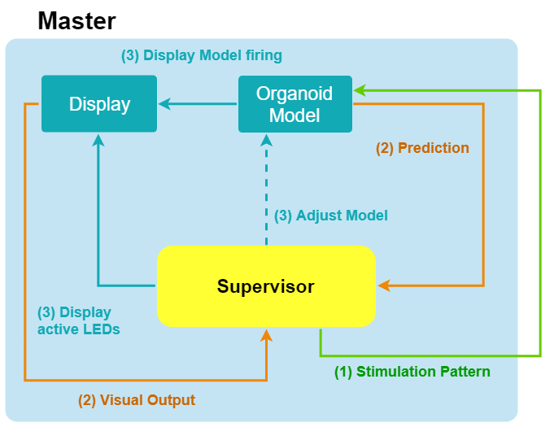
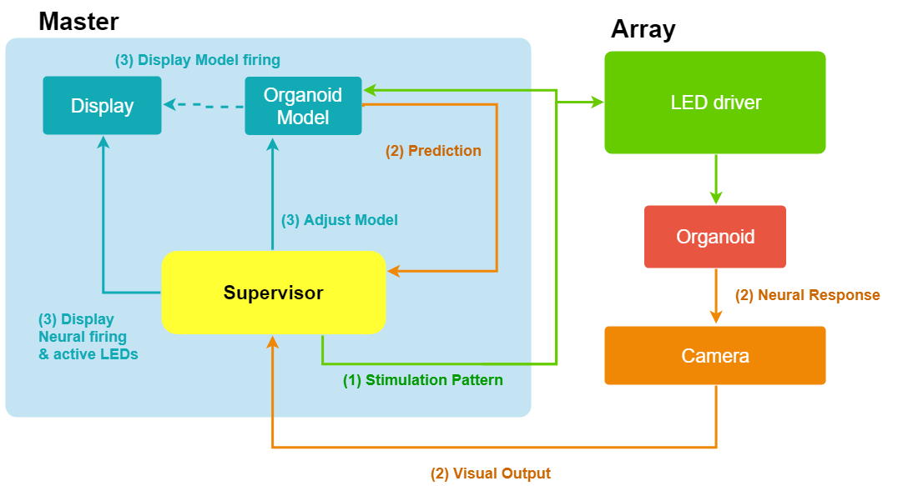
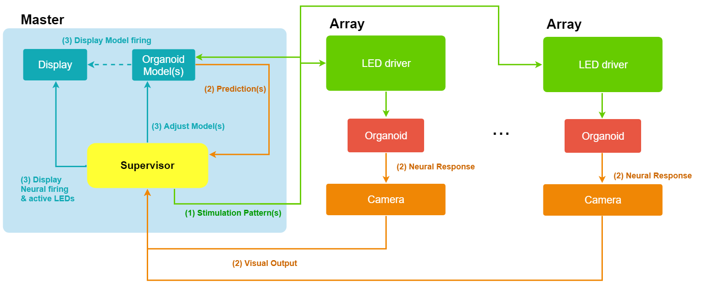

# optogenetic-feedback-loop
Optogenetic feedback loop for shaping the behavior of cortical organoids

## System Architecture

## Contents

### Array
  Drives Raspberry Pi Zero GPIO connected to Serial to Parallel Converter Chips
  - Serial Shift Register Chip: 8 bit, 7HC595 from NXP Semiconductors
    - datasheet: 
      - https://cdn-shop.adafruit.com/datasheets/sn74hc595.pdf
      - https://datasheet.octopart.com/74HC595N-Philips-datasheet-7085704.pdf
  - High-performance GPIO Library bcm2835: https://www.airspayce.com/mikem/bcm2835/
  - Raspberry pi pinout reference: https://pinout.xyz/pinout/wiringpi
  
### Organoid Simulation
- Predict organoid output based on array input, refine model with real organoid data

### Supervisor Algorithm
- Hebbian Learning Feedback Loop
- Mediating connections between different organoids
- Simplified Difference Target Propagation (SDTP)

### Communication Protocol
  - Messages sent via UNIX network sockets
    - Master sends boolean values as a list inside Message
    - Array receives message and toggles LEDs

### Graphics Library 
  - Display events in graphical user interface

